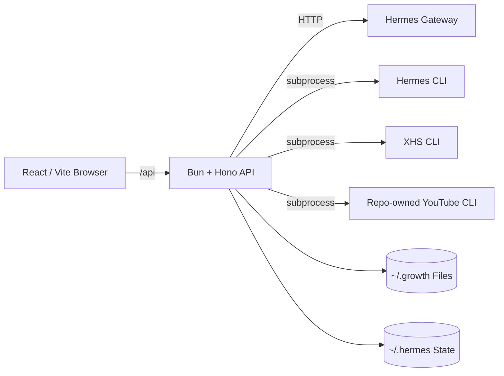
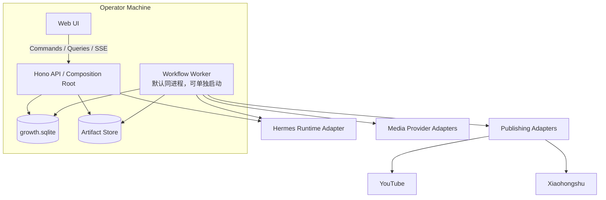
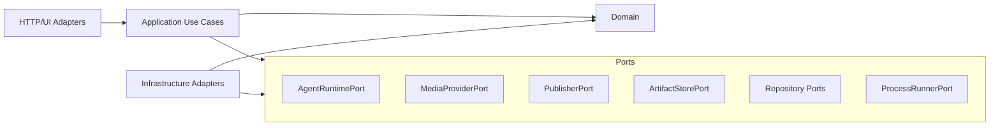
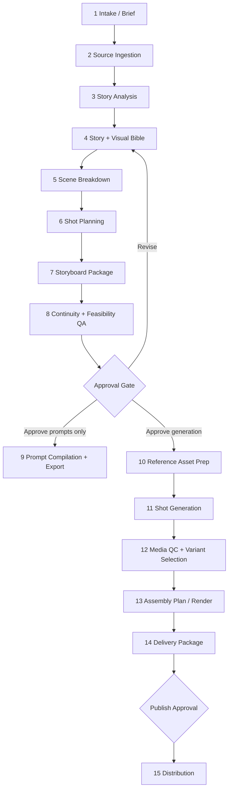

# Growth Hacker Architecture V2

> 面向 `Ancienttwo/growth-hacker` 的工程化重构与视频生产 Workflow 方案  
> 范围：本地优先 Dashboard、Agent Runtime、社媒运营、视频前期制作、镜头生成与发布  
> 原则：渐进式重构，不更换 Bun / Hono / React / Hermes，不引入微服务基础设施

## 0. 执行结论

现有系统的宏观方向是正确的：本地优先、浏览器不接触凭据、Hono API 作为受信边界、Hermes/CLI 通过适配器接入、工作区与产物落本机。这些应继续保留。

需要改变的不是技术栈，而是系统职责分配：

1. 把 `server.ts` 从“所有业务入口”降为组合根，把业务拆为模块化单体。
2. 把 `App.tsx` 从“全局状态容器 + 路由 + 所有页面”拆为路由级 feature。
3. 把 JSON 文件与内存 `JobStore` 从运行态真相源中移除；SQLite 保存任务、步骤、审批、版本和事件，文件系统只保存大文件及可读交付物。
4. 把 Agent 从自由文本执行器改为“有输入/输出 Schema 的步骤执行器”。
5. 把视频生成从 YouTube 平台子功能提升为独立的 **Content Studio / Video Production** 领域；YouTube 只负责分发。
6. 用持久化状态机或 DAG 驱动长流程，支持暂停、审批、重试、恢复、局部失效和重跑。
7. 采用“供应商无关的 Canonical Prompt Spec + Provider Compiler”，避免领域模型被某个视频模型的 Prompt 方言绑定。

最终形态是：**Local-first Modular Monolith + Durable Workflow Kernel + Ports & Adapters**。

---

## 1. 现状审计

### 1.1 当前拓扑



这一拓扑符合单机、单操作者、小团队使用场景，不需要改成微服务。

### 1.2 值得保留的部分

| 能力 | 评价 | V2 决策 |
|---|---|---|
| 浏览器不持有 Hermes/Google 凭据 | 正确的信任边界 | 强制保留 |
| 本地工作区和 Artifact | 符合产品定位 | 保留并增加不可变元数据 |
| `packages/youtube-cli` 的 channel binding、scope、confirm gate、dry-run | 当前最成熟的写操作边界 | 作为所有 Publisher Adapter 的模板 |
| 一个领域一个 server 文件、同目录测试 | 方向合理 | 升级为模块目录，不抛弃现有测试 |
| Hermes profile / skill 机制 | 适合承载角色知识、模板与规则 | 保留，但不承担 durable orchestration |
| 状态检查的超时、缓存、输出脱敏 | 合理 | 提炼为统一 Runtime/Process Adapter |

### 1.3 主要工程问题

| 问题 | 当前表现 | 对视频 Workflow 的影响 |
|---|---|---|
| API 组合与业务耦合 | `server.ts` 内联大量路由、校验和 Prompt 构造 | 每增加一个视频阶段都会继续膨胀 |
| Web 单体组件 | `App.tsx` 同时拥有页面、状态、请求和 EventSource | 分镜编辑器、时间线、审批界面难以维护 |
| 运行态不耐久 | `JobStore` 是进程内 Map | 重启后任务和日志消失，长视频任务无法恢复 |
| JSON 读改写 | cron、board 等以 JSON 为事实源 | 并发更新、调度器与 UI 同时写入时可能丢更新 |
| Agent 输出弱类型 | 依赖最终文本和约定 JSON | 输出漂移后难以自动恢复和局部重跑 |
| 视频功能平台耦合 | 路由位于 `/platforms/youtube/.../video-runs` | 视频内容不能自然复用于 Shorts、XHS、Reels 等渠道 |
| 一次性生成 | 整个请求只调用一次 `video_generate` | 没有剧本分析、场景、镜头、连续性和审批 |
| Artifact 发现脆弱 | 从 Agent 文本中用正则提取 URL/路径 | 非法文本、多个候选、重定向和供应商变化都会造成脆弱性 |
| 合同只在 TypeScript 编译期存在 | `packages/core` 主要是 interface/type | HTTP、Agent、文件导入的运行时输入无法真正验证 |
| 两套任务/cron 语义 | Growth cron 与 Hermes cron 聚合展示 | 通用 Workflow 再叠加后会出现第三套任务生命周期 |

### 1.4 对当前“视频生成”的判断

当前能力适合作为 **单镜头实验入口**，不应继续扩展为正式视频生产系统。它只有标题、Prompt、比例、时长、分辨率和参考图字段；服务端把这些拼成一段指令，要求 Agent 调用一次 `video_generate`，随后从最终文本中寻找视频地址。

它缺少以下核心对象：

- Video Project 与 Revision
- Creative Brief、Story Bible、Visual Bible
- Scene、Beat、Shot、Storyboard Panel
- Continuity Constraint 与 Reference Asset
- Canonical Prompt、Provider-specific Prompt
- Approval、Step Run、Retry、Checkpoint
- Provider Job、Media QC、Assembly Plan
- Prompt/模型/参数/来源的可追溯性

---

## 2. 架构原则与不可破坏约束

### 2.1 架构原则

1. **本地优先，而非本地临时。** 本地数据也必须有事务、迁移、恢复与审计。
2. **内容生产与渠道发布分离。** Video Project 不属于 YouTube；YouTube 是 Distribution Target。
3. **Agent 负责认知，应用负责控制。** Agent 产出结构化候选；状态转换、权限、持久化和重试由应用控制。
4. **Schema first。** HTTP、Agent output、Workflow step output、Artifact manifest 共用可执行 Schema。
5. **大文件在文件系统，关系与运行态在 SQLite。** 数据库不保存视频二进制。
6. **每个昂贵或不可逆步骤前有审批门。** 生成、发布、批量回复等必须显式授权。
7. **步骤可重入、可恢复、可局部重跑。** 不能依赖一次 HTTP 请求生命周期。
8. **供应商能力由 Adapter 声明。** 领域层不假设某个模型一定支持 seed、首尾帧或多参考图。
9. **Prompt 是编译产物，不是唯一真相源。** 领域真相是结构化 ShotSpec / PromptSpec。
10. **可观测性默认存在。** 每个 Project、Run、Step、Agent Run、Provider Job 均有稳定 ID 和事件。

### 2.2 必须保留的产品约束

- 浏览器永远不接触平台凭据、Hermes API Key 或 OAuth Token。
- Agent 默认不能直接获得社媒账号凭据。
- 平台写操作保留 channel/profile binding、dry-run、confirm gate。
- 旧 `~/.growth` / `~/.xiaohongshu` 数据只导入或引用，不做破坏性迁移。
- 状态接口快速退化，不因一个运行时不可用而阻塞整个 Dashboard。
- 所有外部命令必须经过统一超时、取消、脱敏和输出上限控制。

---

## 3. 目标系统架构

### 3.1 系统上下文



`WORKER` 是逻辑角色，不是必须部署的微服务。V2 初期由 server 进程内启动；当视频生成需要独立资源和重启隔离时，使用同一个代码包和 SQLite lease 协议启动独立 worker。

### 3.2 模块依赖规则



依赖只向内：

- Domain 不 import Hono、Hermes、Bun File、YouTube SDK。
- Application 只依赖 Domain 与 Port interface。
- Infrastructure 实现 Port。
- HTTP route 只做认证边界、Schema 验证、调用 use case、映射响应。

### 3.3 建议的 bounded contexts

| Context | 核心职责 | 不应负责 |
|---|---|---|
| Workspace & Artifact | 工作区、文件、元数据、预览、范围读取 | Agent 编排、平台发布 |
| Agent Runtime | Hermes run、事件、模型、权限模式、结构化返回 | 业务状态机 |
| Workflow | Run、Step、Retry、Approval、Event、Schedule | 视频专业语义 |
| Content Studio | Project、Source、Revision、Deliverable | 平台 Token |
| Video Production | Brief、Bible、Scene、Shot、Prompt、Storyboard、QC | YouTube 上传 |
| Social Operations | Board、Calendar、Auto Reply、运营任务 | 通用 Workflow 内核 |
| Distribution | YouTube/XHS 等发布计划与适配器 | 内容生成 |
| Runtime & Observability | CLI、进程、健康状态、日志、trace | 领域决策 |

---

## 4. 推荐目录结构

不建议为每个小概念创建一个 npm package。Package 只用于真正稳定且可独立测试/复用的边界；业务模块仍放在 `apps/server` 内。

```text
apps/
  server/
    src/
      bootstrap/
        createApp.ts
        dependencies.ts
        worker.ts
      http/
        middleware/
          errorBoundary.ts
          requestId.ts
          validation.ts
        routes/
          health.routes.ts
          workspace.routes.ts
          agent.routes.ts
          workflow.routes.ts
          video.routes.ts
          social.routes.ts
          distribution.routes.ts
      modules/
        workspace/
          domain/
          application/
          infrastructure/
        workflow/
          domain/
          application/
          infrastructure/
        video/
          domain/
          application/
          workflows/
          infrastructure/
        social/
        distribution/
      adapters/
        hermes/
        media/
        publishers/
        cli/
      infrastructure/
        db/
          migrations/
          database.ts
        artifacts/
        events/
        security/
        observability/
  web/
    src/
      app/
        router.tsx
        providers.tsx
        apiClient.ts
      routes/
      features/
        workspace/
        chat/
        workflow-runs/
        video-projects/
        storyboard/
        distribution/
      entities/
        project/
        scene/
        shot/
        artifact/
      shared/
        ui/
        api/
        hooks/
        errors/

packages/
  contracts/
    src/
      common/
      workflows/
      video/
      social/
      distribution/
  workflow-kernel/
    src/
      definition.ts
      runner.ts
      retry.ts
      events.ts
  youtube-cli/

skills/
  creative/
    video-production-skill/
      SKILL.md
      schemas/
      prompts/
      references/
      templates/
      scripts/
```

### 4.1 `packages/core` 的迁移

将当前单一 `index.ts` 渐进拆为 `packages/contracts`：

```text
contracts/src/
  common/error.ts
  common/artifact.ts
  workspace/contracts.ts
  workflow/contracts.ts
  video/project.ts
  video/scene.ts
  video/shot.ts
  video/prompt.ts
  social/contracts.ts
  distribution/contracts.ts
  index.ts
```

每个外部边界必须同时提供：

- TypeScript inferred type
- Runtime Schema，例如 Zod
- JSON Schema 或 OpenAPI 输出
- Schema version

禁止只写 `interface` 后直接把 `unknown` 强制转换为 `Record<string, unknown>`。

---

## 5. 数据与持久化

### 5.1 真相源划分

| 数据 | 真相源 | 说明 |
|---|---|---|
| Project、Revision、Scene、Shot | SQLite | 需要关系、事务、版本和局部更新 |
| Workflow Run、Step、Event、Approval | SQLite | 必须跨进程重启恢复 |
| Social board、Growth cron | SQLite | 与 Workflow 统一生命周期 |
| Agent/Provider 调用元数据 | SQLite | 可追踪模型、成本、重试和外部 ID |
| 视频、图片、音频、源文档 | 文件系统 | 大文件，不放 DB |
| Markdown、CSV、JSONL、HTML 交付包 | 文件系统 | 面向人和外部工具，可重新生成 |
| OAuth Token / secrets | 原有受限文件或系统 Keychain | DB 只保存 secret reference，不保存明文 |
| Hermes state | Hermes 自有 DB，只读或通过 API | 不复制为本系统真相源 |

### 5.2 数据库位置与配置

建议新增单一运营数据库：

```text
~/.growth/dashboard/growth.sqlite
```

配置：

```sql
PRAGMA journal_mode = WAL;
PRAGMA foreign_keys = ON;
PRAGMA busy_timeout = 5000;
```

所有 schema 通过编号 SQL migration 管理；禁止在每次 repository 打开时分散执行 `create table if not exists` 作为长期迁移方案。

### 5.3 核心表

```text
project
project_revision
source_document
creative_entity
video_scene
video_shot
prompt_spec
artifact
artifact_relation
workflow_definition
workflow_run
workflow_step_run
workflow_event
approval_request
agent_run
provider_job
distribution_plan
schedule
```

建议字段摘要：

```sql
project(
  id text primary key,
  kind text not null,
  title text not null,
  status text not null,
  current_revision_id text,
  created_at integer not null,
  updated_at integer not null
)

project_revision(
  id text primary key,
  project_id text not null references project(id),
  revision_no integer not null,
  parent_revision_id text,
  source_hash text not null,
  brief_json text not null,
  created_at integer not null,
  unique(project_id, revision_no)
)

workflow_run(
  id text primary key,
  definition_key text not null,
  definition_version integer not null,
  project_id text,
  revision_id text,
  status text not null,
  input_json text not null,
  output_json text,
  cancel_requested integer not null default 0,
  created_at integer not null,
  updated_at integer not null
)

workflow_step_run(
  id text primary key,
  workflow_run_id text not null references workflow_run(id),
  step_key text not null,
  status text not null,
  attempt integer not null default 0,
  input_hash text not null,
  input_json text not null,
  output_json text,
  lease_owner text,
  lease_expires_at integer,
  next_attempt_at integer,
  error_code text,
  error_json text,
  started_at integer,
  finished_at integer,
  unique(workflow_run_id, step_key, input_hash)
)

workflow_event(
  seq integer primary key autoincrement,
  workflow_run_id text not null,
  step_run_id text,
  type text not null,
  payload_json text not null,
  created_at integer not null
)
```

### 5.4 Artifact 目录

Content Studio 应使用平台无关目录：

```text
~/.growth/studio/projects/<project-id>/
  source/
  revisions/<revision-no>/
    brief/
    screenplay/
    bible/
    scenes/
    shots/
    storyboard/
    prompts/
    audio/
    renders/
    qc/
    export/
    manifest.json
```

平台工作区只保存发布引用或发布后的副本：

```text
~/.growth/<profile>/<platform>/artifacts/distributions/<distribution-id>/
```

每个 Artifact metadata 至少包含：

```ts
interface ArtifactRecord {
  id: string;
  projectId?: string;
  revisionId?: string;
  kind: string;
  path: string;
  mime: string;
  size: number;
  sha256: string;
  source: "user" | "agent" | "provider" | "web" | "derived";
  provenance?: Record<string, unknown>;
  syntheticMedia?: boolean;
  rights?: "owned" | "licensed" | "unknown";
  createdByRunId?: string;
  createdByStepId?: string;
  createdAt: number;
}
```

Artifact 写入流程：流式写到 temp、检查字节上限和 MIME/magic bytes、计算 SHA-256、`fsync`、原子 rename、最后在事务中登记 metadata。

---

## 6. Durable Workflow Kernel

### 6.1 为什么必须增加

视频生产是跨分钟或跨小时的多阶段过程，包含外部 Provider、人工审批、局部编辑和昂贵重试。它不能由：

- 一个 HTTP 请求
- 一个 Hermes chat session
- 一个内存 Map
- 一条最终自由文本

来代表完整生命周期。

### 6.2 Workflow Definition

```ts
export interface WorkflowDefinition<I, O> {
  key: string;
  version: number;
  inputSchema: Schema<I>;
  outputSchema: Schema<O>;
  steps: readonly StepDefinition<any, any>[];
}

export interface StepDefinition<I, O> {
  key: string;
  inputSchema: Schema<I>;
  outputSchema: Schema<O>;
  dependencies: readonly string[];
  retry: {
    maxAttempts: number;
    backoff: "fixed" | "exponential";
    retryableCodes: readonly string[];
  };
  execute(ctx: StepContext, input: I): Promise<O>;
}
```

Step 状态：

```text
queued
running
waiting_approval
waiting_external
succeeded
failed
cancelled
skipped
stale
```

Run 状态：

```text
draft -> running -> waiting_approval -> running -> completed
                         |                 |
                       cancelled        failed
```

### 6.3 执行语义

- Worker 以事务领取一个 `queued` step，写入 lease 和 heartbeat。
- 同一 step 的幂等键为 `run_id + step_key + input_hash`。
- 进程崩溃后，lease 过期的 step 可被重新领取。
- 输出必须通过 Schema 后才能在事务内标记成功。
- 不可恢复错误进入 `failed`；可恢复错误按策略安排 `next_attempt_at`。
- 用户取消写 `cancel_requested`，worker 在安全点中止并调用 Provider cancel。
- SSE 来自持久化 `workflow_event`，支持 `Last-Event-ID` 重连，而不是只订阅进程内 listener。
- 修改上游 Revision 后，通过依赖图将受影响的步骤标记 `stale`，只重跑下游。

### 6.4 Schedule 统一

Growth cron、Social board task 和视频批处理最终都提交 Command 到 Workflow Kernel：

```text
Schedule -> Workflow Run -> Step Runs -> Events -> Board/Calendar Projection
```

Hermes 自有 cron 继续作为外部只读来源展示；不要把它与 Growth-managed schedule 混成同一个可写实体。

---

## 7. Agent Runtime 与 Provider Adapter

### 7.1 Agent 的正确职责

Agent 可以：

- 分析故事、提取实体、规划场景和镜头
- 生成结构化 PromptSpec
- 进行创意审阅和连续性审阅
- 解释失败并给出修复建议

Agent 不可以：

- 决定数据库状态转移
- 随意写任意工作区路径
- 直接拿平台 Token
- 用自然语言假装步骤已完成
- 通过最终文本隐式返回 Artifact 地址
- 在未审批时发布或批量消耗昂贵额度

### 7.2 Agent Runtime Port

```ts
interface AgentRuntimePort {
  runStructured<T>(request: {
    role: string;
    templateId: string;
    templateVersion: number;
    input: unknown;
    outputSchema: Schema<T>;
    model?: string;
    provider?: string;
    permissionMode: "read_only" | "ask" | "full_access";
    timeoutMs: number;
    idempotencyKey: string;
  }): Promise<{
    output: T;
    runId: string;
    model?: string;
    provider?: string;
    usage?: Record<string, number>;
    rawArtifactId?: string;
  }>;
}
```

Hermes Adapter 的实现策略：

1. 优先使用 runtime 原生 structured output / tool result。
2. 若 runtime 暂不支持 JSON Schema，则在 Prompt 中要求单一 JSON，使用严格 `JSON.parse` + Schema validate。
3. 校验失败允许一次受限 repair run；仍失败则步骤失败，保留原始输出供诊断。
4. 禁止以正则从任意正文中“猜”业务对象。

### 7.3 Media Provider Port

```ts
interface MediaProviderCapabilities {
  textToVideo: boolean;
  imageToVideo: boolean;
  firstLastFrame: boolean;
  referenceImages: boolean;
  negativePrompt: boolean;
  seed: boolean;
  supportedAspectRatios: string[];
  minDurationSeconds: number;
  maxDurationSeconds: number;
  resolutions: string[];
}

interface MediaProviderPort {
  key: string;
  capabilities(): Promise<MediaProviderCapabilities>;
  submitShot(request: ProviderShotRequest): Promise<ProviderJobRef>;
  poll(job: ProviderJobRef): Promise<ProviderJobStatus>;
  cancel(job: ProviderJobRef): Promise<void>;
  acquireArtifacts(job: ProviderJobRef): Promise<ProviderArtifact[]>;
}
```

现有 Hermes `video_generate` 作为第一个 `MediaProviderPort` 实现，而不是继续直接嵌在 YouTube route 中。

### 7.4 Publisher Port

```ts
interface PublisherPort {
  platform: string;
  inspectTarget(profileId: string): Promise<BoundTarget>;
  validate(plan: DistributionPlan): Promise<ValidationReport>;
  publish(plan: DistributionPlan, approval: ApprovalToken): Promise<PublicationResult>;
}
```

YouTube CLI 继续承担 OAuth、scope、channel binding 和 confirm gate；Application 层只传已审批的 DistributionPlan。

---

## 8. Video Production Domain

### 8.1 聚合与核心对象

```text
VideoProject
  └── ProjectRevision
      ├── ProductionBrief
      ├── SourceDocument[]
      ├── StoryBible
      ├── VisualBible
      ├── Character[]
      ├── Location[]
      ├── Prop[]
      ├── Scene[]
      │   └── Shot[]
      │       ├── StoryboardPanel[]
      │       ├── CanonicalPromptSpec
      │       ├── CompiledPrompt[]
      │       └── RenderVariant[]
      └── DeliveryPackage
```

### 8.2 稳定 ID

- Scene：`SC001`
- Shot：`SC001-SH001`
- Character：`CHAR-<slug>`
- Location：`LOC-<slug>`
- Wardrobe：`WARD-<character>-<version>`
- Reference Asset：`REF-<kind>-<sequence>`

ID 在 revision 内稳定，UI 排序使用独立 `ordinal`，避免拖拽后改变所有引用。

### 8.3 Production Brief

最小字段：

```ts
interface ProductionBrief {
  title: string;
  objective: string;
  audience: string;
  format: "narrative" | "commercial" | "explainer" | "music" | "social-short";
  language: string;
  targetDurationSeconds: number;
  targetAspectRatios: Array<"16:9" | "9:16" | "1:1">;
  tone: string[];
  visualStyle: string;
  pacing: "slow" | "moderate" | "fast";
  dialoguePolicy: "none" | "voiceover" | "sync-dialogue" | "mixed";
  platformTargets?: string[];
  hardConstraints: string[];
  prohibitedElements: string[];
  referenceAssetIds: string[];
  generationBudget?: {
    maxShotVariants: number;
    maxProviderCalls?: number;
    maxEstimatedCost?: number;
  };
}
```

### 8.4 ShotSpec

```ts
interface ShotSpec {
  id: string;
  sceneId: string;
  ordinal: number;
  storyBeat: string;
  purpose: string;
  durationSeconds: number;

  framing: {
    shotSize: "ECU" | "CU" | "MCU" | "MS" | "MLS" | "LS" | "ELS" | "insert" | "POV";
    cameraAngle: string;
    composition: string;
    lensMm?: number;
    depthOfField?: string;
  };

  camera: {
    movement: string;
    speed?: string;
    stabilization?: string;
    startFrame?: string;
    endFrame?: string;
  };

  blocking: {
    subjects: string[];
    action: string;
    screenDirection?: string;
    eyeline?: string;
  };

  environment: {
    locationId: string;
    timeOfDay: string;
    weather?: string;
    atmosphere?: string;
  };

  look: {
    lighting: string;
    colorPalette: string[];
    texture?: string;
    styleTokens: string[];
  };

  continuity: {
    characterIds: string[];
    wardrobeIds: string[];
    propIds: string[];
    referenceAssetIds: string[];
    mustMatchPreviousShotIds: string[];
  };

  audio: {
    dialogue?: string;
    voiceover?: string;
    sfx?: string[];
    musicCue?: string;
  };

  edit: {
    transitionIn?: string;
    transitionOut?: string;
    cutMotivation?: string;
  };

  constraints: string[];
  negativeConstraints: string[];
  qcCriteria: string[];
}
```

### 8.5 Canonical Prompt Spec

Domain 中保存结构，不保存某个供应商的最终字符串作为唯一真相：

```ts
interface CanonicalVideoPromptSpec {
  schemaVersion: 1;
  shotId: string;
  subject: string;
  action: string;
  setting: string;
  composition: string;
  camera: string;
  lighting: string;
  color: string;
  motion: string;
  temporalProgression: string;
  durationSeconds: number;
  aspectRatio: string;
  resolution?: string;
  fps?: number;
  referenceAssetIds: string[];
  dialogue?: string;
  audioIntent?: string;
  negative: string[];
  hardConstraints: string[];
  continuityTokens: string[];
}
```

`PromptCompiler` 根据 Provider capabilities 输出：

```ts
interface CompiledPrompt {
  shotId: string;
  providerKey: string;
  providerModel?: string;
  compilerVersion: string;
  text: string;
  negativeText?: string;
  parameters: Record<string, unknown>;
  warnings: string[];
}
```

---

## 9. 视频生产 Workflow

### 9.1 总体流程



### 9.2 Stage 1：Intake / Brief

输入：故事、剧本、提纲、字幕、参考链接或自然语言要求。

输出：

- 标准化 ProductionBrief
- 缺失信息与系统采用的 assumptions
- 目标时长、比例、语言和发布渠道
- 成本/次数预算
- 风格参考和禁止项

此步骤不调用生成视频工具。

### 9.3 Stage 2：Source Ingestion

职责：

- 保存原始输入，不覆盖
- 识别输入格式：plain text、Markdown、Fountain、字幕、PDF 导入结果等
- 标准化为内部 screenplay/document AST
- 记录 source hash 和 provenance
- 将输入内容视为数据，隔离其中可能出现的工具指令或 Prompt injection

输出：`source.normalized.json`、`screenplay.normalized.md`。

### 9.4 Stage 3：Story Analysis

Agent role：Script Analyst。

输出：

- logline、主题、类型、受众
- 角色和关系
- 故事节拍 / beats
- 情绪曲线
- 关键冲突与转折
- 需要补充或澄清的叙事缺口
- 时长可行性分析

所有输出必须映射到 source span，避免凭空添加重大剧情。

### 9.5 Stage 4：Story Bible / Visual Bible

Agent roles：Creative Director + Continuity Supervisor。

Story Bible：

- 角色身份、年龄段、性格、动机、关系
- 场景、道具、时间线
- 世界规则和禁止冲突

Visual Bible：

- 摄影语言、镜头运动原则
- 色板、光线、材质、画幅
- 每个角色的外观、发型、服装版本
- 地点的空间布局与标志物
- 参考图策略和 continuity tokens

修改 Bible 会自动令 Scene/Shot/Prompt/Render 下游步骤 stale。

### 9.6 Stage 5：Scene Breakdown

每个 Scene 输出：

- scene ID、slugline、地点、时间
- 场景目的、进入状态、退出状态
- 覆盖的 beats
- 预计时长
- 角色、道具、服装和连续性条件
- 对话、旁白和声音要求
- 是否需要拆为多段生成

验证：所有故事 beats 必须至少被一个 scene 覆盖；总时长在 Brief 容差内。

### 9.7 Stage 6：Shot Planning

Agent roles：Storyboard Artist + Cinematographer。

每个 Scene 可并行规划 Shot，但必须读取同一 Revision 的 Bible。随后由 Continuity Reviewer 做跨 Scene 检查。

Shot planning 要求：

- 每个镜头一个明确叙事目的
- 标注镜别、机位、运动、镜头焦段、构图、Blocking、时长
- 明确第一帧与最后一帧的状态
- 对连续动作标记 screen direction、eyeline、prop hand、wardrobe
- 标注音频、对白、转场和剪辑动机
- 将长动作拆为供应商可实现的短镜头

### 9.8 Stage 7：Storyboard Package

必须支持两种输出：

1. **Text storyboard**：即使没有图像模型，也能生成专业完整文档。
2. **Visual storyboard**：可选生成关键帧或使用参考图，拼成 HTML/PDF contact sheet。

每个 panel 包含：

- Scene/Shot ID
- 缩略图或占位图
- Frame description
- Camera / lens / movement
- Action / dialogue / audio
- Duration
- Continuity notes
- Prompt status

### 9.9 Stage 8：QA 与审批

先运行确定性 linter，再运行 Agent reviewer。

确定性规则至少包括：

- ID 唯一、引用完整
- Shot 时长和总时长合法
- Beat 覆盖率
- Character/wardrobe/prop/location ID 均存在
- 同一动作的 screen direction / eyeline 不冲突
- Provider 不支持的参数被标记
- 对白长度与镜头时长粗略可行
- 所有昂贵生成步骤都有 budget
- 所有网络素材都有 provenance 和 rights 状态

审批可选择：

- 退回 Brief/Bible/Scene/Shot 指定层级
- 只导出 Prompt/文档，不生成媒体
- 批准生成指定 Scene 或 Shot
- 批准全部生成

### 9.10 Stage 9：Prompt Compilation

每个 Shot 先生成 Canonical PromptSpec，再由 Provider Compiler 输出具体 Prompt。

禁止一个 Agent 同时：理解剧本、决定镜头、猜供应商限制、提交生成、解析视频 URL。上述职责必须分步。

编译器输出 warning，而不是静默删除不支持能力。例如：

```text
SHOT SC003-SH002 requests first/last-frame control,
but provider hermes-video/default does not advertise this capability.
Fallback: use first-frame reference only.
```

### 9.11 Stage 10–12：生成、轮询与 QC

按 Shot 提交，而不是把整部故事交给一次 `video_generate`。

Provider Job 生命周期：

```text
created -> submitting -> queued_external -> running_external
        -> artifact_ready -> qc_pending -> accepted
        -> failed / cancelled / needs_regeneration
```

策略：

- 默认每个 Shot 1 个变体；用户或 QA 只对失败镜头追加变体。
- Provider concurrency 由 Adapter 限制。
- 外部 job ID 立即持久化。
- 支持轮询、webhook（若供应商支持）和取消。
- 下载媒体时逐跳验证重定向、DNS/IP、内容长度、MIME 和 magic bytes；流式落盘，不一次性读入内存。
- QC 读取实际 metadata：分辨率、帧率、时长、音轨、文件可解码性。
- 可选视觉 QC：黑帧、冻结帧、文本伪影、主体突变、角色连续性。

### 9.12 Stage 13–15：Assembly 与 Distribution

Assembly 输出：

- `timeline.json`
- 可选 OTIO / FCPXML / EDL
- 选定 render variant 映射
- 转场、音频、字幕和裁切计划
- `ffmpeg` 命令计划或 renderer job

Distribution 是独立 Workflow：

```text
DeliveryPackage -> DistributionPlan -> Validate Target
-> Approval -> Publisher Adapter -> Publication Record
```

---

## 10. 专业交付包

即使没有任何视频 Provider，Preproduction Workflow 也必须完整生成以下交付物：

```text
export/
  00-manifest.json
  01-production-brief.md
  02-story-analysis.md
  03-story-bible.yaml
  04-visual-bible.md
  05-screenplay-normalized.md
  06-scene-breakdown.json
  06-scene-breakdown.csv
  07-shot-list.json
  07-shot-list.csv
  08-storyboard.html
  08-storyboard.md
  09-continuity-report.md
  10-prompts/
    canonical.jsonl
    hermes-video.jsonl
    <future-provider>.jsonl
  11-voiceover-script.md
  12-subtitles-draft.srt
  13-edit-plan.json
  14-generation-manifest.json
  15-qa-report.md
```

`00-manifest.json` 示例：

```json
{
  "schemaVersion": 1,
  "projectId": "vp_...",
  "revisionId": "vpr_...",
  "workflowRunId": "wfr_...",
  "generatedAt": "...",
  "sourceHash": "sha256:...",
  "promptTemplates": {
    "storyAnalysis": "1.0.0",
    "shotPlanning": "1.0.0",
    "promptCompiler": "1.0.0"
  },
  "agentRuns": [],
  "artifacts": [],
  "warnings": []
}
```

人类文档由结构化 JSON 派生。编辑器修改结构化对象后，可以稳定重建 Markdown、CSV、HTML 和 Prompt 文件，避免多份手工文件互相漂移。

---

## 11. Video Skill 设计

新增：

```text
skills/creative/video-production-skill/
  SKILL.md
  PRODUCT.md
  schemas/
    production-brief.schema.json
    story-analysis.schema.json
    story-bible.schema.json
    scene.schema.json
    shot.schema.json
    prompt-spec.schema.json
  prompts/
    script-analyst/v1.md
    creative-director/v1.md
    scene-breakdown/v1.md
    shot-planner/v1.md
    continuity-review/v1.md
    prompt-compiler/v1.md
  references/
    film-language.md
    shot-taxonomy.md
    continuity-rules.md
    duration-and-pacing.md
    provider-capability-model.md
    prompt-style-guide.md
    qa-checklist.md
  templates/
    storyboard.html
    production-package.md
  scripts/
    validate-video-package.ts
    render-storyboard.ts
```

Skill 的职责：专业知识、角色 Prompt、参考规则、模板和 validator。

Application Workflow 的职责：步骤顺序、状态、Schema 校验、重试、审批、持久化和 Provider 调用。

两者不能颠倒。`SKILL.md` 不应成为唯一状态机。

---

## 12. HTTP API V1

所有 API 采用统一 envelope、runtime validation、request ID 和结构化错误。

### 12.1 Project / Source

```http
POST   /api/v1/studio/projects
GET    /api/v1/studio/projects
GET    /api/v1/studio/projects/:projectId
PATCH  /api/v1/studio/projects/:projectId

POST   /api/v1/studio/projects/:projectId/sources
GET    /api/v1/studio/projects/:projectId/revisions
POST   /api/v1/studio/projects/:projectId/revisions
```

### 12.2 Video entities

```http
GET    /api/v1/video/projects/:projectId/brief
PUT    /api/v1/video/projects/:projectId/brief
GET    /api/v1/video/projects/:projectId/bible
PUT    /api/v1/video/projects/:projectId/bible
GET    /api/v1/video/projects/:projectId/scenes
PATCH  /api/v1/video/projects/:projectId/scenes/:sceneId
GET    /api/v1/video/projects/:projectId/shots
PATCH  /api/v1/video/projects/:projectId/shots/:shotId
```

### 12.3 Workflow

```http
POST   /api/v1/video/projects/:projectId/workflows/preproduction
POST   /api/v1/video/projects/:projectId/workflows/generation
POST   /api/v1/video/projects/:projectId/workflows/export

GET    /api/v1/workflow-runs/:runId
GET    /api/v1/workflow-runs/:runId/steps
GET    /api/v1/workflow-runs/:runId/events
POST   /api/v1/workflow-runs/:runId/cancel
POST   /api/v1/workflow-runs/:runId/retry
```

### 12.4 Approval

```http
GET    /api/v1/approvals
POST   /api/v1/approvals/:approvalId/decisions
```

Decision body：

```json
{
  "decision": "approve",
  "scope": {
    "sceneIds": ["SC001"],
    "shotIds": []
  },
  "comment": "..."
}
```

### 12.5 Error contract

```json
{
  "error": {
    "code": "VIDEO_SHOT_SCHEMA_INVALID",
    "message": "Shot output failed validation",
    "retryable": true,
    "details": {},
    "requestId": "req_..."
  }
}
```

旧 `/api/platforms/youtube/profiles/:profile/video-runs` 在迁移期保留，内部转换为：创建临时 VideoProject -> 单 Shot Workflow -> 返回兼容 run ID；UI 不再使用旧端点。

---

## 13. Web 架构

### 13.1 页面路由

```text
/studio/projects
/studio/projects/:projectId/brief
/studio/projects/:projectId/source
/studio/projects/:projectId/bible
/studio/projects/:projectId/scenes
/studio/projects/:projectId/storyboard
/studio/projects/:projectId/prompts
/studio/projects/:projectId/renders
/studio/projects/:projectId/export
/studio/projects/:projectId/distribution
/workflows/:runId
```

### 13.2 状态管理

- Server state：使用 query/cache layer 管理，按 key 精确失效。
- Form/editor state：保留在 feature 内；未保存编辑使用本地 reducer。
- URL state：当前 scene、shot、tab、filter 进入 route/search params。
- Workflow state：以服务端持久化状态为准，SSE 仅负责增量更新。
- 不使用一个全局 `busy: string | null`。
- 不在 `App` 中维护所有 domain state。

### 13.3 Storyboard 工作台

布局建议：

```text
┌ Project / Revision / Run status ──────────────────────────────┐
├ Scene Navigator ┬ Storyboard Grid / Timeline ┬ Shot Inspector ┤
│ SC001           │ [SH001][SH002][SH003]       │ framing        │
│ SC002           │ [SH001][SH002]              │ camera         │
│ ...             │                              │ continuity     │
├─────────────────┴──────────────────────────────┴────────────────┤
│ Activity / Agent events / Validation / Approval                 │
└─────────────────────────────────────────────────────────────────┘
```

核心交互：

- Scene/Shot 拖拽排序但 stable ID 不变
- Shot diff 与 Revision diff
- 批量选择后生成 Prompt 或媒体
- 每个镜头独立状态与重试
- Continuity warning 直接链接到冲突字段
- Approval 显示预计调用数、额度和影响范围
- Prompt 同时显示 Canonical 与 Provider compiled 版本

---

## 14. 安全设计

### 14.1 权限与 Prompt injection

- 用户剧本和上传文档始终作为 data message，不拼入 system instruction。
- 分析阶段使用 `read_only`，不得调用 shell、发布或平台工具。
- 生成阶段只授予 Media Provider tool，不授予 Publisher tool。
- 发布阶段只接收已冻结 DeliveryPackage 与审批 token。
- Agent 输出中的路径、URL、命令均视为不可信输入。

### 14.2 远程 Artifact 获取

替换“从正文抓 URL 后直接 fetch”的通用路径：

1. Provider Adapter 返回 typed artifact descriptor。
2. 优先使用 provider domain allowlist 或一次性 signed URL。
3. DNS 解析后阻止 loopback、private、link-local、multicast、metadata IP。
4. 每次 redirect 重新验证 protocol、host 和解析 IP。
5. 限制 redirect 次数、响应头时间、总时长和字节数。
6. 流式写 temp，不使用大文件 `arrayBuffer()`。
7. 校验 MIME、扩展名和 magic bytes。
8. 原子提交 Artifact；失败清理 temp。

### 14.3 发布与费用

- 每次批量生成和发布都有显式 ApprovalRequest。
- Approval 绑定 project revision、workflow run、资源范围和预算；Revision 变化后 token 失效。
- Publisher 继续验证绑定频道/账号。
- 记录 synthetic-media、rights 和 provenance，供平台元数据与审计使用。

---

## 15. 可观测性

所有日志使用结构化字段：

```text
request_id
project_id
revision_id
workflow_run_id
step_run_id
agent_run_id
provider_job_id
distribution_id
```

记录：

- 步骤排队、开始、heartbeat、完成、失败、重试
- Agent template/version、模型、provider、usage、耗时
- Provider job 状态、轮询次数、产物 metadata
- Artifact hash、来源、派生关系
- 审批决策
- 发布目标和结果

不记录：Token、Cookie、Authorization header、完整 OAuth payload、未脱敏 CLI 输出、模型隐藏推理。

Dashboard 指标：

- Workflow 成功率、恢复率、平均重试数
- Agent Schema 首次通过率与 repair 率
- Shot generation 成功率和每镜头变体数
- Continuity warning 数
- Provider 耗时、错误码和估算成本
- Pending approvals

---

## 16. 测试策略

### 16.1 单元测试

- Domain invariant：ID、时长、引用、Revision、审批范围
- Schema validators
- Prompt compiler 与 capability fallback
- Retry/backoff 分类
- Path/URL/security guards
- Deterministic video package linter

### 16.2 Workflow 测试

- 固定输入的 step graph 和状态转换
- Worker 中途退出、lease 过期后恢复
- 同一 input hash 不重复提交
- 上游编辑只使正确的下游 step stale
- 取消、审批、拒绝、局部重试
- Event replay 与 SSE Last-Event-ID

### 16.3 Adapter contract tests

每个 Adapter 跑同一 contract suite：

- Hermes structured output success / malformed / timeout / approval
- Media submit / poll / cancel / artifact acquisition
- Publisher target binding / dry-run / confirm
- CLI non-zero exit、超时、SIGTERM/SIGKILL、脱敏

### 16.4 集成测试

- 临时 SQLite + 临时 Artifact root
- 真实 Hono route + fake Hermes/provider
- Migration upgrade/downgrade fixture
- 大文件流式下载、redirect、SSRF、oversize、错误 MIME

### 16.5 E2E

- 故事输入 -> Preproduction package -> 编辑一个 Shot -> 局部重编 Prompt
- 审批指定 Scene -> fake generation -> QC -> export
- 重启 server/worker 后继续运行
- DeliveryPackage -> YouTube dry-run -> approve -> fake publish

### 16.6 质量评估集

维护一组固定的短故事、广告、讲解、竖屏短视频和对白场景。评价：

- Schema 完整率
- Beat coverage
- 总时长误差
- Shot 可生成性
- 连续性冲突
- 人工评审的可拍摄性、叙事清晰度、Prompt 可用性

不要对自然语言全文做脆弱 snapshot；对结构、ID、约束、必填字段和关键语义做断言。

---

## 17. 渐进式实施顺序

### Phase 0：建立不可回归基线

- 记录现有 route、contract、workspace 和 credential invariants。
- 为旧 video route、artifact persistence、JobStore、server startup 增加 integration fixtures。
- 统一 request ID、error envelope 和 `app.onError`。
- 建立 SQL migration runner。

验收：现有功能不变，测试可证明旧行为。

### Phase 1：拆组合根与 Contract

- 将 `server.ts` 按 route module 拆分。
- 将 `packages/core` 分拆为 runtime schema + inferred types。
- 抽统一 API client、CLI process runner、guards。
- Web 先机械拆 view，再引入 router/query layer。

验收：`server.ts` 只负责依赖装配；`App.tsx` 只保留 shell/provider/router。

### Phase 2：Durable Workflow Kernel

- 建 SQLite 表、repository、worker lease、event log、SSE replay。
- 先迁移 `JobStore`，再迁移 Growth cron/social board。
- 保留旧 API contract，底层改为 workflow projection。

验收：运行中杀进程并重启，任务能够恢复且事件不丢。

### Phase 3：Video Preproduction MVP

- 建 `VideoProject`、Revision、Brief、Scene、Shot、PromptSpec。
- 实现 Intake -> Analysis -> Bible -> Scene -> Shot -> QA -> Approval -> Export。
- 新增 `video-production-skill`、Schema、validator、storyboard template。
- UI 提供项目、Brief、Scene、Storyboard、Prompt、Export 页面。

验收：只给故事或剧本，即可产出第 10 节的完整专业交付包；即便没有视频 Provider 也成立。

### Phase 4：媒体生成

- 将 Hermes `video_generate` 包装为 `MediaProviderPort`。
- 实现 per-shot submit/poll/cancel/acquire、并发限制、budget、QC 和变体选择。
- 移除从最终自然语言正则抓视频引用的主路径；仅保留旧兼容适配器。

验收：只重试失败镜头；重启不重复提交已登记的 provider job。

### Phase 5：Assembly 与 Distribution

- 生成 timeline、字幕、音频和 renderer plan。
- DeliveryPackage 与 YouTube/XHS Publisher 解耦。
- 所有平台写操作使用 Approval + profile/channel binding。

验收：同一 DeliveryPackage 可创建多个 DistributionPlan，而不重新生成内容。

### Phase 6：清理兼容层

- Dashboard 不再调用旧 YouTube video route。
- 旧 JSON 运行态改为导入/导出格式或删除写路径。
- 删除死平台 stub，或在 Adapter registry 中明确标记 unavailable。
- 更新 architecture snapshot、ADR 和 operational runbook。

---

## 18. 关键 ADR

### ADR-001：保留模块化单体，不上微服务

理由：单机单操作者，SQLite 与本地 Artifact 是产品边界；微服务会增加部署、认证、消息队列和诊断成本，不能解决当前核心问题。

### ADR-002：SQLite 是运行态真相源，JSON 是导出格式

理由：Workflow、审批、重试、版本关系和 cron 需要事务及可恢复性。文件系统仍保存大文件和可读交付物。

### ADR-003：Video 是内容领域，不属于 YouTube

理由：同一故事、镜头和媒体可投放多个平台；平台只影响 DistributionPlan 和少量输出变体。

### ADR-004：Agent 不作为 Workflow Engine

理由：自由文本不能提供事务、幂等、恢复、审批和可靠状态转换。Agent 是一个受约束的 Step executor。

### ADR-005：Canonical PromptSpec 是真相源

理由：Provider API、模型和 Prompt 语法会变化；结构化镜头语义需要稳定、可校验、可迁移。

### ADR-006：Human-in-the-loop 是一等对象

理由：生成和发布具有成本、品牌和账号风险；审批必须可审计且绑定具体 Revision 与 scope。

### ADR-007：不实施全系统 Event Sourcing

理由：只为 Workflow 保存 append-only event log；业务当前状态仍使用普通关系表，避免不必要复杂度。

---

## 19. 明确不做

- 不迁移到 Next.js、NestJS、Redux、Kubernetes、Kafka、Redis 或云端 Temporal。
- 不建立自由对话式“多 Agent 群聊”来代替步骤图。
- 不让每个专业角色成为长期、有独立记忆的 daemon。
- 不把视频二进制写入 SQLite。
- 不以 Provider-specific Prompt 字符串作为唯一项目数据。
- 不从 Agent 任意正文继续正则抓业务对象作为主合同。
- 不让 Agent 直接发布账号内容。
- 不为未来尚未实现的平台在类型中假装完整支持。

---

## 20. Definition of Done

V2 架构达到以下条件才算完成：

1. Server 或 Worker 在任意步骤被杀死后，运行可从持久状态恢复。
2. 同一 Step 的相同输入不会因重试产生不可解释的重复副作用。
3. Agent 输出不符合 Schema 时，系统明确失败或受限修复，不静默猜测。
4. 修改一个 Shot 只使该 Shot 的 Prompt/Render 与依赖的 Assembly stale。
5. 没有视频 Provider 时仍能生成完整专业分镜和 Prompt 交付包。
6. Provider 变化只新增/修改 Adapter 与 Compiler，不修改核心 Shot domain。
7. 同一 Video Project 可发布到多个渠道，内容生产不依赖 YouTube profile。
8. Browser、Agent 和日志均看不到平台凭据。
9. 所有昂贵生成和不可逆发布都有可追踪 Approval。
10. API、Agent、Workflow、Artifact 都有 versioned runtime schema。
11. `App.tsx` 和 `server.ts` 不再拥有跨领域业务逻辑。
12. 单元、workflow 恢复、adapter contract、integration、E2E 与安全测试均通过。
